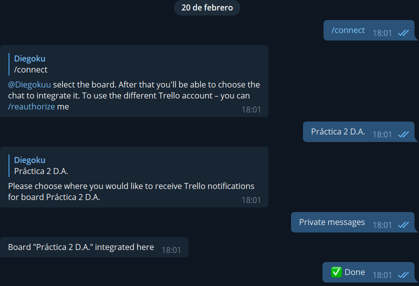
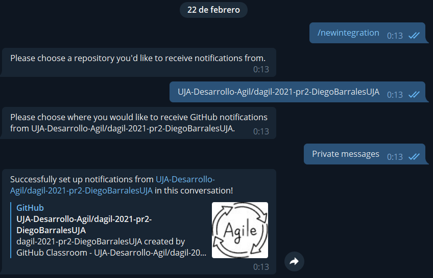
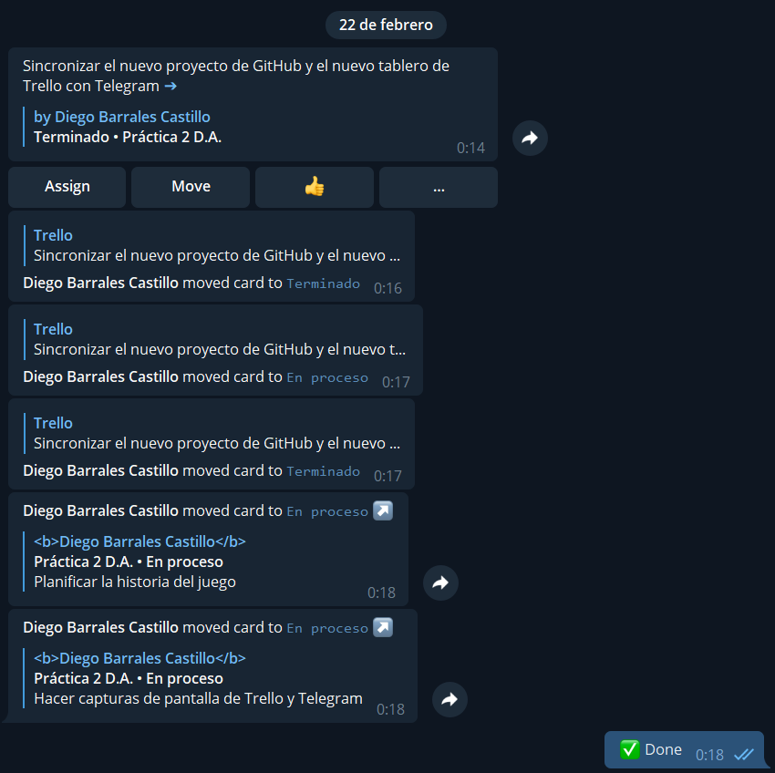
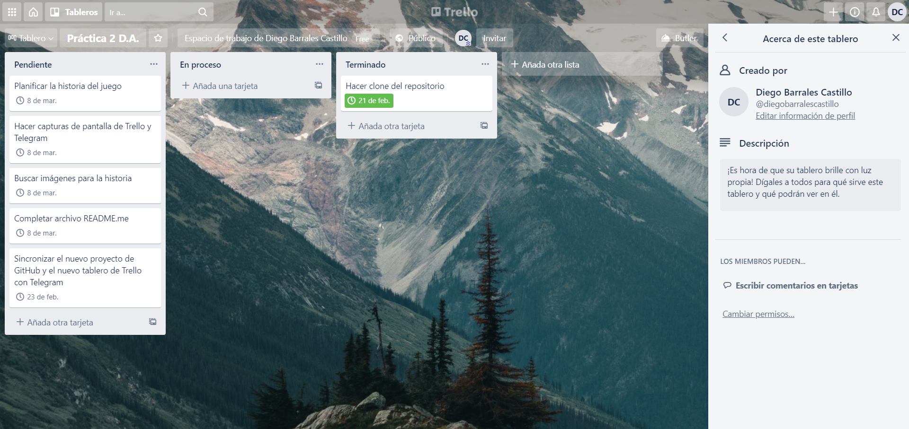
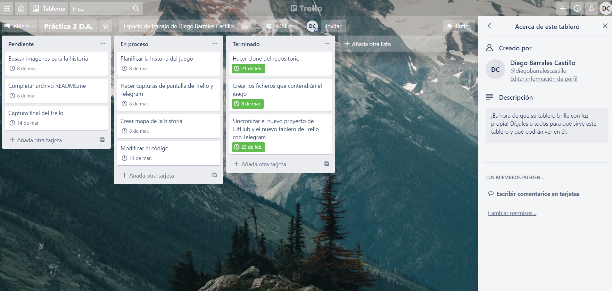
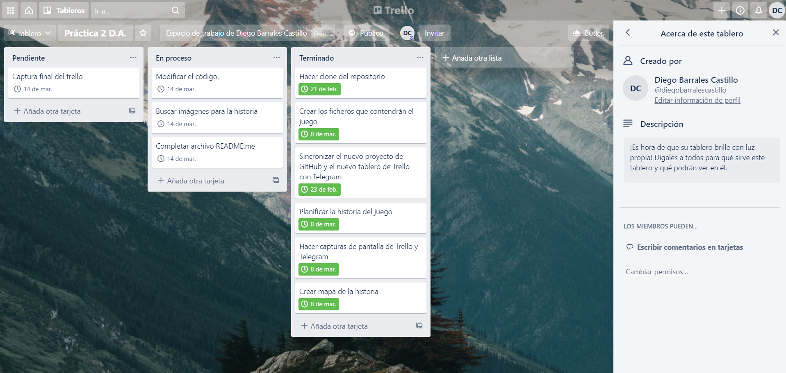
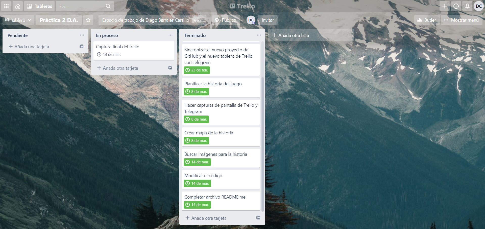

# Diego Barrales Castillo (dbc00009) - Práctica 2 Desarrollo Ágil

## Título: Tarta de zanahoria

Tu madre te manda ir al supermercado porque necesita ingredientes para hacer una tarta de
zanahoria para el cumpleaños de tu hermano, que es al día siguiente.
Encontrarás inconvenientes que harán que no sea una tarea sencilla.
Si no tomas las decisiones correctas puede que alguien te odie para siempre.

## Trello

[Enlace al tablero](https://trello.com/b/0IZ2We9v/pr%C3%A1ctica-2-da)

## Capturas de Telegram

Aquí queda reflejado que tanto el repositorio del proyecto como el tablero en Trello están correctamente enlazados a Telegram.

Dos días después de enlazar Trello fui consciente de que había olvidado enlazar el repositorio de GitHub.

## Captura del tablero al comienzo del proyecto:

## Captura del tablero a mediados del proyecto:

## Captura del tablero al haber avanzado y añadidos ciertos puntos:

## Captura final del tablero:

Aquí el único paso que falta es esta misma captura, por lo tanto están acabadas todas las tareas.

PD: no me he asignado las tareas a mí mismo porque al ser el único miembro del proyecto no lo he visto necesario.
